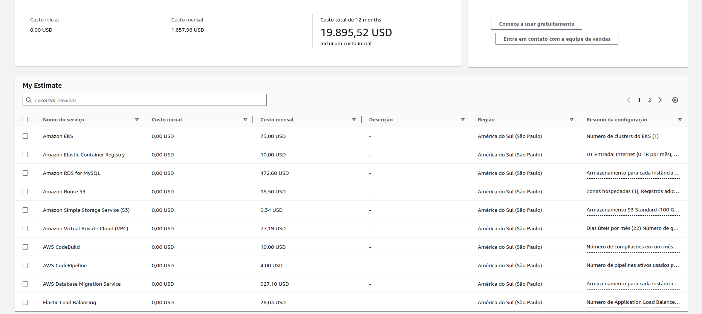

# Projeto Fast-Engineering - Documento de Planejamento.
## DESCRIÇÃO.
Nós somos da empresa "Fast Engineering S/A" e gostaríamos de uma solução dos senhores(as), que fazem parte da empresa terceira "TI SOLUÇÕES INCRÍVEIS". Nosso eCommerce está crescendo e a solução atual não está atendendo mais a alta demanda de acessos e compras que estamos tendo. Desde o Início do ano, os acessos e compras estão crescendo 20% a cada mês. Atualmente usamos:
* 01 servidor para Banco de Dados Mysql;
* 01 servidor para a aplicação utilizando REACT;
* 01 servidor de web Server e que armazena estáticos como fotos e links.

### Arquitetura Atual

    

## REQUISITOS DA NOVA SOLUÇÃO.

* Ambiente Kubernetes;
* Banco de dados PaaS;
* MultiAZ;
* Segurança de backup de dados;
* Persistência dos dados;
* Balanceamento de carga com healthcheck;
* Segurança (liberar somente o necessário/mínimo acesso possível).

## ARQUITETURA DA NOVA SOLUÇÃO.

### Serviços Utilizados
#### Rede:
1. **VPC (Virtual Private Cloud):**
   - A VPC permite que você crie uma rede virtual na nuvem da AWS, isolada logicamente, onde você pode lançar recursos da AWS, como instâncias EC2 ou bancos de dados RDS.

2. **Route53:**
   - É um serviço de sistema de nomes de domínio (DNS) altamente disponível e escalável. Ele facilita a rota de solicitações de usuários da Internet para os recursos da AWS, como EC2 instâncias, Load Balancers (ELBs) ou S3 buckets.

3. **ELB (Elastic Load Balancer):**
   - O ELB distribui automaticamente o tráfego de entrada de aplicativos em várias instâncias EC2 em uma ou mais zonas de disponibilidade. Isso aumenta a disponibilidade e a confiabilidade de seus aplicativos.

#### Computação:
4. **EKS (Elastic Kubernetes Service):**
   - É um serviço gerenciado que facilita a execução, escalonamento e orquestração de contêineres Docker usando o Kubernetes na AWS. Permite a implantação simplificada de aplicativos baseados em contêineres.

#### Dados:
5. **S3 (Simple Storage Service):**
   - O S3 é um serviço de armazenamento de objetos que permite armazenar e recuperar quantidades praticamente ilimitadas de dados de forma segura. É usado para armazenar arquivos, imagens, vídeos e qualquer outro tipo de objeto.

6. **RDS (Relational Database Service):**
   - O RDS simplifica a configuração, operação e escalonamento de bancos de dados relacionais na nuvem. Oferece suporte a vários motores de banco de dados, como MySQL, PostgreSQL, Oracle e SQL Server.

#### Segurança:
7. **NACL (Network Access Control List):**
   - As NACLs são conjuntos de regras de controle de acesso que controlam o tráfego de entrada e saída em sub-redes em uma VPC. Funcionam como firewalls a nível de sub-rede.

8. **IAM (Identity and Access Management):**
   - O IAM é um serviço que ajuda a controlar o acesso a recursos da AWS atribuindo permissões e autenticação a usuários, grupos e papéis.

9. **WAF (Web Application Firewall):**
   - O WAF é um firewall de aplicativos da web que ajuda a proteger seus aplicativos da web contra ataques comuns da web, como injeção SQL, cross-site scripting (XSS) e outros.

10. **Security Groups:**
    - Os Security Groups são conjuntos de regras de firewall que controlam o tráfego de entrada e saída para instâncias EC2. Eles agem no nível da instância e permitem especificar as regras de tráfego permitidas.

## PIPELINES E WORKFLOWS.

### Serviços Utilizados
1. **CodeCommit:**
   - CodeCommit é um serviço de controle de versão totalmente gerenciado que hospeda repositórios Git privados. Ele fornece um ambiente seguro e escalável para armazenar e gerenciar código fonte na nuvem.

2. **CodeBuild:**
   - CodeBuild é um serviço de compilação totalmente gerenciado que compila código fonte, executa testes e gera artefatos prontos para implantação. Ele é integrado ao CodeCommit e ao CodePipeline para automatizar o processo de integração contínua.

3. **CodePipeline:**
   - CodePipeline é um serviço de entrega contínua que automatiza a construção, teste e implantação de aplicativos. Ele permite criar pipelines que conectam vários serviços, como CodeCommit, CodeBuild e ECR, para automatizar o fluxo de trabalho de entrega.

4. **ECR (Elastic Container Registry):**
   - ECR é um registro de contêiner totalmente gerenciado que facilita o armazenamento, gerenciamento e implantação de imagens de contêiner Docker. Ele integra-se perfeitamente ao Amazon ECS e ao CodeBuild para facilitar a construção e implantação de aplicativos em contêineres.

## MIGRAÇÃO.

    

### Serviços Utilizados
1. **DMS (Database Migration Service):**
   - O DMS é um serviço que facilita a migração de dados entre diferentes tipos de bancos de dados, incluindo migrações homogêneas e heterogêneas. Ele suporta a replicação contínua e em tempo real, ajudando na transferência eficiente de dados entre fontes e destinos.

## ACESSO SEGURO A RECURSOS.

    

### Serviços Utilizados
### SSM (Systems Manager)
1. **Session Manager para EKS:**
   - O Session Manager é um serviço do AWS Systems Manager que oferece acesso seguro e controlado a instâncias EC2 e servidores on-premise. Além disso, é possível configurá-lo para fornecer acesso a nós (nodes) do Amazon EKS, permitindo a execução de comandos de shell ou a abertura de sessões de terminal de maneira segura e simplificada. Isso elimina a necessidade de abrir portas SSH diretamente nos nós do EKS.

2. **Run Command:**
   - O Run Command também pode ser usado para executar comandos em nós do EKS, oferecendo uma abordagem automatizada para tarefas administrativas em larga escala.

## ORÇAMENTO
* **Custo Mensal: $1.657,96 USD**  
* **Custo Anual: $19.895,52 USD**

    

Acesse o link do cálculo de custos <a href="https://calculator.aws/#/estimate?id=689266df76976f7dea81de5ec8ae6cc56991ae17" target="_blank">aqui!</a>

 

## PRAZO DE ENTREGA

## CRONOGRAMA MACRO DE ENTREGAS

### [Fase 1: Planejamento e Análise]

### [Fase 2: Desenvolvimento]

### [Fase 3: Testes]

### [Fase 4: Implementação]

### [Fase 5: Monitoramento e Manutenção]

## REFERÊNCIAS

### Data
- [Amazon S3 Documentation](https://docs.aws.amazon.com/pt_br/s3/?nc2=h_ql_doc_s3)
- [Amazon RDS Documentation](https://docs.aws.amazon.com/AmazonRDS/latest/UserGuide/Welcome.html)
### Containers
- [Amazon EKS Documentation](https://docs.aws.amazon.com/eks/?icmpid=docs_homepage_containers)
- [Amazon ECR Documentation](https://docs.aws.amazon.com/ecr/?icmpid=docs_homepage_containers)
### Network
- [Amazon VPC Documentation](https://docs.aws.amazon.com/vpc/?icmpid=docs_homepage_featuredsvcs)
- [Amazon Route 53 Documentation](https://docs.aws.amazon.com/route53/?icmpid=docs_homepage_networking)
- [Amazon ELB Documentation](https://docs.aws.amazon.com/elasticloadbalancing/?icmpid=docs_homepage_networking)
### Security
- [Amazon WAF Documentation](https://docs.aws.amazon.com/waf/?icmpid=docs_homepage_security)
- [Amazon IAM Documentation](https://docs.aws.amazon.com/iam/?icmpid=docs_homepage_security)

### Management
- [Amazon CloudTrail Documentation](https://docs.aws.amazon.com/cloudtrail/?icmpid=docs_homepage_mgmtgov)
- [Amazon CloudWatch Documentation](https://docs.aws.amazon.com/cloudwatch/?icmpid=docs_homepage_mgmtgov)

### Migration
- [AWS Database Migration Service Documentation](https://docs.aws.amazon.com/dms/?icmpid=docs_homepage_migration)

### Infrastructure as Code (IaC)
- [Terraform Provider AWS Documentation](https://registry.terraform.io/providers/hashicorp/aws/latest/docs)

## Notas Adicionais