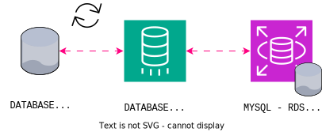

# Projeto Fast-Engineering - Documento de Planejamento
## DESCRIÇÃO

Nós somos da empresa "Fast Engineering S/A" e gostaríamos de uma solução dos senhores(as), que fazem parte da empresa terceira "TI SOLUÇÕES INCRÍVEIS". Nosso eCommerce está crescendo e a solução atual não está atendendo mais a alta demanda de acessos e compras que estamos tendo. Desde o Início do ano, os acessos e compras estão crescendo 20% a cada mês. Atualmente usamos:
* 01 servidor para Banco de Dados Mysql;
* 01 servidor para a aplicação utilizando REACT;
* 01 servidor de web Server e que armazena estáticos como fotos e links.

### Arquitetura Atual

    

## REQUISITOS DA NOVA SOLUÇÃO

* Ambiente Kubernetes;
* Banco de dados PaaS;
* MultiAZ;
* Segurança de backup de dados;
* Persistência dos dados;
* Balanceamento de carga com healthcheck;
* Segurança (liberar somente o necessário/mínimo acesso possível).

## ARQUITETURA DA NOVA SOLUÇÃO

### Serviços Utilizados
#### Rede:
* VPC
* Route53
* ELB

#### Computação:
* EKS

#### Dados:
* S3
* RDS
#### Segurança:
* NACL
* IAM
* WAF
* SecurityGroups

## PIPELINES E WORKFLOWS

### Serviços Utilizados
* CodeCommit
* CodeBuild
* CodePipeline
* ECR

## MIGRAÇÃO

    

### Serviços Utilizados
* DMS

## ORÇAMENTO

    

Acesse o link do cálculo de custos <a href="https://calculator.aws/#/estimate?id=689266df76976f7dea81de5ec8ae6cc56991ae17" target="_blank">aqui!</a>

 

## PRAZO DE ENTREGA

## CRONOGRAMA MACRO DE ENTREGAS

### [Fase 1: Planejamento e Análise]

### [Fase 2: Desenvolvimento]

### [Fase 3: Testes]

### [Fase 4: Implementação]

### [Fase 5: Monitoramento e Manutenção]

## REFERÊNCIAS

### Data
- [Amazon S3 Documentation](https://docs.aws.amazon.com/pt_br/s3/?nc2=h_ql_doc_s3)
- [Amazon RDS Documentation](https://docs.aws.amazon.com/AmazonRDS/latest/UserGuide/Welcome.html)
### Containers
- [Amazon EKS Documentation](https://docs.aws.amazon.com/eks/?icmpid=docs_homepage_containers)
- [Amazon ECR Documentation](https://docs.aws.amazon.com/ecr/?icmpid=docs_homepage_containers)
### Network
- [Amazon VPC Documentation](https://docs.aws.amazon.com/vpc/?icmpid=docs_homepage_featuredsvcs)
- [Amazon Route 53 Documentation](https://docs.aws.amazon.com/route53/?icmpid=docs_homepage_networking)
- [Amazon ELB Documentation](https://docs.aws.amazon.com/elasticloadbalancing/?icmpid=docs_homepage_networking)
### Security
- [Amazon WAF Documentation](https://docs.aws.amazon.com/waf/?icmpid=docs_homepage_security)
- [Amazon IAM Documentation](https://docs.aws.amazon.com/iam/?icmpid=docs_homepage_security)

### Management
- [Amazon CloudTrail Documentation](https://docs.aws.amazon.com/cloudtrail/?icmpid=docs_homepage_mgmtgov)
- [Amazon CloudWatch Documentation](https://docs.aws.amazon.com/cloudwatch/?icmpid=docs_homepage_mgmtgov)

### Migration
- [AWS Database Migration Service Documentation](https://docs.aws.amazon.com/dms/?icmpid=docs_homepage_migration)

### Infrastructure as Code (IaC)
- [Terraform Provider AWS Documentation](https://registry.terraform.io/providers/hashicorp/aws/latest/docs)

## Notas Adicionais